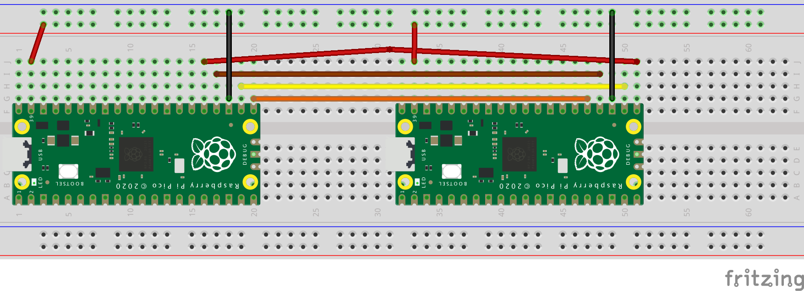

= Communicating as master and slave via SPI

This example code shows how to interface two RP2040 microcontrollers to each other using SPI.

== Wiring information

[frame="topbot",options="header"]
|===
| Function | Master (RP2040) | Slave (RP2040) | Master (Pico) | Slave (Pico)
| MOSI | DO0  | DI0  | 25 | 21
| SCLK | SCK0 | SCK0 | 24 | 24
| GND  | GND  | GND  | 23 | 23
| CS   | CS0  | CS0  | 22 | 22
| MISO | DI0  | DO0  | 21 | 25
|===

[[spi_master_slave_wiring]]
[pdfwidth=75%]
.Wiring Diagram for SPI Master and Slave.

At least one of the boards should be powered, and will share power to the other.

If the master is not connected properly to a slave, the master will report reading all zeroes.

If the slave is not connected properly to a master, it will initialize but never transmit nor receive, because it's waiting for clock signal from the master.
